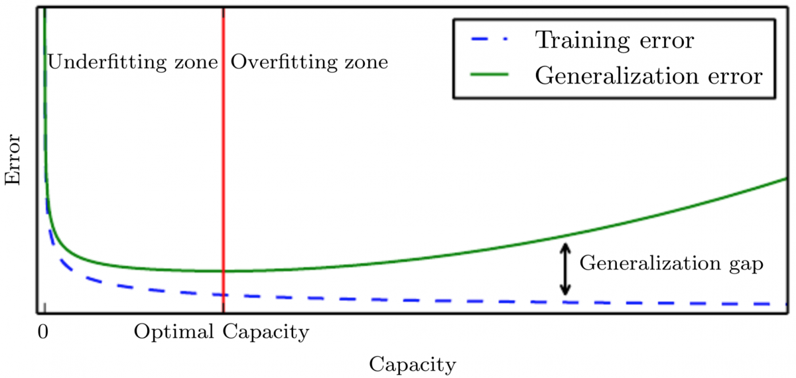

# 아래 그래프를 보고 물음에 답하여라. (출처 : [Deep Learning Book](https://www.deeplearningbook.org/))

- 어느 지점 이후에서 Overfitting이 발생했다고 이야기 할 수 있는가?
- Generalization Gap이란 무엇인가?
- Early Stopping이란 무엇인가? Early Stopping의 맥락에서 x축에 들어가야 할 변수는 무엇이겠는가?
- 위 그래프에서 Capacity 대신 x축에 들어갈 수 있는 변수들을 최대한 많이 적어라.
- Generalization Error를 직접 측정할 수 있는가? 만약 아니라면 어떻게 추정할 수 있는가?