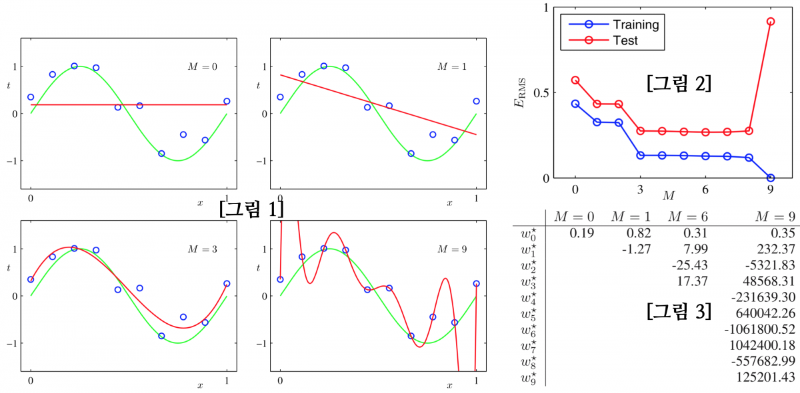

# 07. 아래 그림들은 10개 데이터에 대해 M차 다항함수를 학습시킨 결과이다. 그림 1은 학습된 함수들의 개형을, 그림 2는 Training / Test error를, 그림 3은 학습된 Parameter들의 값을 표로 나타낸 것이다. 이를 보고 다음 물음들에 답하여라. (출처 : Pattern Recognition and Machine Learning)

- 그림 1에서 가장 적절한 M의 값을 찾고 그 이유를 설명하라.
- 그림 3을 보고, L1 / L2 Regularization의 적용이 필요해 보이는 상황과 그 이유에 대해 설명하라.
- 그림 2에서 Test Error가 가장 낮은 모형을 선택해도 되는가?
- Hyperparameter란 무엇인가? 위 그림들에서 Hyperparameter와 Parameter는 어떤 것들인지 찾아라.