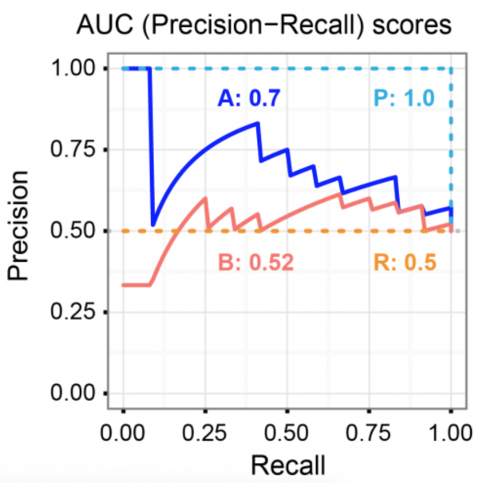

# 08. Evaluation Metric에 대한 다음 물음들에 답하여라. 

- Evaluation Metric이 필요한 두 가지 이유에 대해 설명하라.
- 어떤 Evaluation Metric을 사용할지는 누가 정하는가?
- 어떤 Evaluation Metric을 사용할지는 Hyperparameter의 일종이라고 할 수 있는가?

- 회귀 문제에서는 어떤 Evaluation Metric들을 사용하는가?
- 이진 분류 문제에서는 어떤 Evaluation Metric들을 사용하는가?
- 다중 분류 문제에서는 어떤 Evaluation Metric들을 사용하는가?
- 객체 탐지 문제에서는 어떤 Evaluation Metric을 사용하는지 찾아보아라.
- 기계 번역 문제에서는 어떤 Evaluation Metric을 사용하는지 찾아보아라.

- R Square에 대해 설명하라.
- Confusion Matrix란 무엇인가?
- Accuracy / Precision / Recall / F-Score에 대해 설명하라.
- Class Imbalance 문제에 대해 설명하라.
- Accuracy를 사용하는 것은 언제 문제가 될 수 있는가?
- Precision – Recall Curve를 그리는 방법에 대해 설명하라.
- 아래 그래프에서 모형 A와 모형 B 중 어떤 모형의 PR CURVE가 더 우수한지 판단하라.

