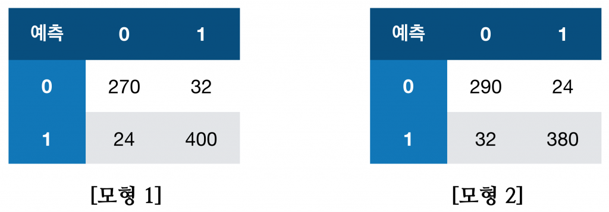

# 09. 어떤 데이터의 이진 분류를 위해 양성일 확률을 예측하는 두 모형을 학습시키고, Threshold를 0.5로 설정하여 Confusion Matrix를 구해보았다. 결과를 보고 두 모형 중 하나를 선택하려고 하는 상황이라고 할 때, 다음 물음에 답하여라.

- Training / Validation / Test Set 중 어느 데이터에 대한 Confusion Matrix인가?
- Accuracy를 기준으로 판단하였을 때, 어떤 모형을 선택해야 하는가? Precision과 Recall, F-Score를 기준으로 판단하는 경우에는 각각 어떤 모형을 선택해야 하는가?
- 만약 Threshold를 0.5보다 더 높힌다면 Precision과 Recall, F-Score는 어떻게 변할지 설명하라. Precision과 Recall의 관계에 대해 설명하라.
- 최적의 Threshold를 정하는 방법에 대해 논하라. Threshold를 정하지 않은 상태에서 가장 좋은 모형을 찾고싶다면 어떤 Evaluation Metric을 사용해야 하는가?
- 수업에서 다루지 않았던 이진 분류의 Evaluation Metric을 하나 찾고, 그것을 기준으로 선택해 보아라.