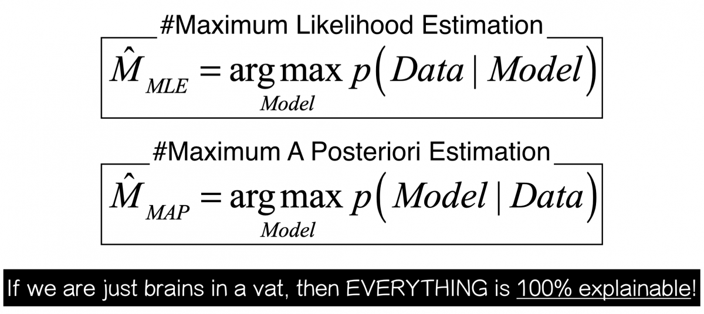

# 11. 최대 우도 추정법 (Maximum Likelihood Estimation)에 대한 다음 물음들에 답하여라.

- 학습된 두 모형의 의미에 대해 설명하라. 어떤 모형이 데이터, 즉 현상을 설명하는데 더 합리적인 모형인가?
- 데이터가 적은 상태에서 MLE를 사용하는 것의 문제점에 대해 설명하고, MLE와 Overfitting과의 관계를 설명하라.
- 베이즈 정리를 이용하여 MAP는 p(Data|Model)*p(Model)를 최대화하는 모형을 찾는것과 동치임을 보여라.
- 상대적으로 데이터의 변동에 덜 민감한 학습 방식은 무엇이고 그 이유는 무엇인가?